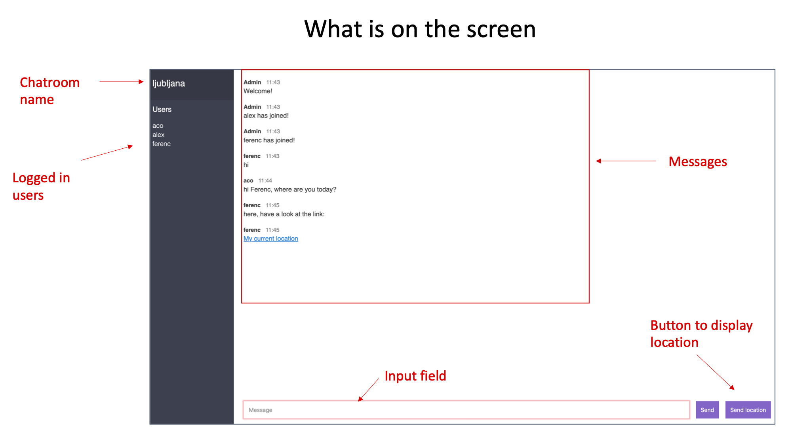

This is a chatroom app. You can use it to chat with many people simultaneously.

The app was written in node.js for learning and demo purposes. It uses Google Maps to display a location. The app does not use a database or any other persistent data, it is all in main memory. Refreshing your browser will restart the app.

## Content

<a href="#using-this-app">Using this app</a>  
<a href="#deploying-the-app-locally">Deploying the app locally</a>  
<a href="#deploying-to-kubernetes-on-ibm-cloud">Deployment to Kubernetes on IBM Cloud</a>
<a href="#deployment-on-ibm-cloud">Deployment to IBM Cloud - Cloud Foundry</a>  
<a href="#deploy-the-app-as-a-docker-container">Deploy app as a Docker container</a>

## Using this app

Start using the app this way:

1. Open the app URL in yor browser. If your app is not running yet, deploy it as described in sections below.
2. Write your name in the field **Display name**. Any name works, you don't have to register first.
3. Write the name of the chatroom you are joining in field **Room**. Any room name works, rooms are not defined upfront. However, in order to chat with other people, they must login to the same room as you.
4. Press enter.
5. You are in the chatroom. On your screen you see:
   - Top left: name of your chatroom
   - Left: names of people in your chatroom
   - Middle: content of your chat
   - Bottom middle: input field for your message
   - Bottom right: button to share your location with all participants. This will send them the link to your location in Google Maps.

## Deploying the app locally

1. Download and install [node.js](https://nodejs.org/en/download/) on your computer.
2. Download and unpack this repo.
3. Change current directory to directory with this repo.
4. Install all required node packages with command
   `npm install`
5. Start the app with command `npm start`
6. Open the app by typing in your web browser: `localhost:3000`

## Deployment to Kubernetes on IBM Cloud

Refer to instructions in file "Demo scenario for Deployment to Kubernetes on IBM Cloud.pdf"

## Deployment to IBM Cloud - Cloud Foundry

1. Do first four steps from previous section.
2. Login to IBM Cloud with command
   `ibmcloud login`
   - Provide your IBM Cloud account data: email and password.
   - Select the region, for example **eu-de** for Germany
3. Connect to your IBM Cloud organisation and work space by typing in
   `ibmcloud target -o <your_organization -s <your_space>`
4. Edit the file **manifest.yml** to provide your unique application name, for example _chat-app-yourname_
5. Deploy the app with command
   `ibmcloud app push -c "npm start"`
   The deployment data will be read from the manifest.yml.

## Deploy app as a Docker container

You can get the Docker image for this app in one of two ways:

- In [Docker hub](https://hub.docker.com/r/acovid/chat-app), pull the image **acovid/chat-app**
- Build your own image using Dockerfile (see instructions below)

1. Building your own Docker image:

   - download this git repo
   - in your terminal/command line, unzip the repo
   - change current directory to directory with this repo
   - delete the _node_modules_ directory, you don't need it in your image
   - type in: `docker build -t <your_app_name>:1 .` (Do not forget the dot at the end).

2. Run the container with your app locally: `docker run -d -p <your_port>:3000 chat-app:1`

3. In your web browser, access the app at **localhost:<your_port>**
